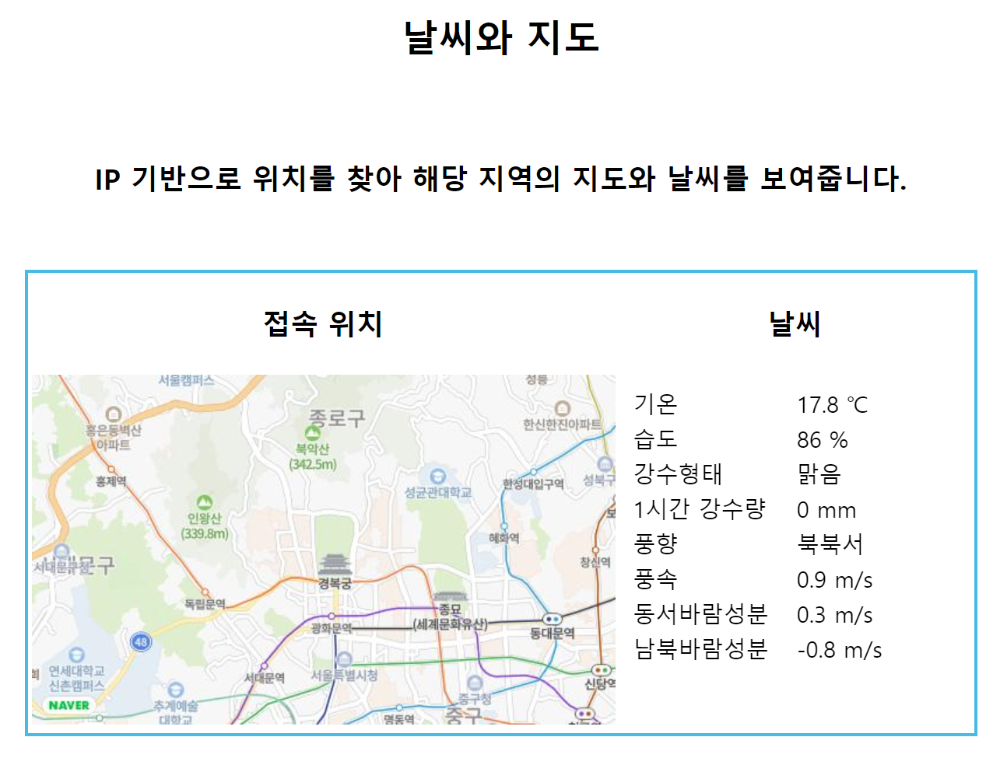

# WebSocket만으로 이미지 및 텍스트 보여주기

2학년 2학기 수업 때 배운 WebSocket으로 스터디한 코드 입니다.
WebSocket만 이용해서 비동기 방식으로 클라이언트에게 페이지를 전달하도록 작성했습니다.
IP 기반으로 위치를 파악하여 해당 위치의 지도 이미지와 날씨 정보를 가져와서 화면에 보여줍니다.

## 실행결과

 

작성 기간

+ 21.11.19 ~ 21.12.14
+ 22.05.05(비동기 방식 추가)
